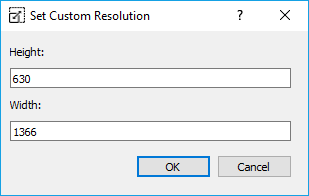

# InQ
InQ is a sketchbook application made as the final project for CSE 4302: Object-Oriented Programming Lab.

## Team Members:
* Syed Rifat Raiyan- 180041205
* Syed Mohammad Sartaj Ekram- 180041204

## Features:
### Adjustable Brush Thickness:

### Color Palette:
Select one from and array of 48 basic colors. Adjust shades, hues and saturation to form custom colors. Scan a custom color from the screen.

### Geometric Shapes:
7 geometric shapes (Ellipse, Isosceles Triangle, Rectangle, Pentagon, Hexagon, Four-point Star, Arrow) and Straight Line.

### Floodfill:
Fill an enclosed area of the canvas by selecting a fill color.

This feature was implemented using the Breadth First Search [Floodfill Algorithm](https://en.wikipedia.org/wiki/Flood_fill). 

### Zooming:
Zoom In and Zoom Out magnifies and diminishes the size of the canvas respectively.

wherever you are xD

### Open File:
Opens a new .jpg, .png or .bmp file.

### Save File:
Saves the image in .jpg, .png or .bmp format in a directory with untitled.png as default name.

 

### Change Image Resolution:
For cropping or increasing the resolution of the image.

## Resources:
### Icons:
* [Oxygen theme](https://github.com/KDE/oxygen-icons5/)- by The Oxygen Team (LGPL v3).
* [Icons8](https://icons8.com/)- a site for free icons.

### Documentation:
* [Qt Documentation for All Classes.](https://doc.qt.io/qt-5/classes.html)

### App Logo:
[Inq, the inquisitive Octopus](https://184.154.203.234/images/galleries/gallery/inq-the-curiosity-mascot-full-shadows.png)- mascot of the [Curiosity Box](https://www.curiositybox.com/) by VSauce.
